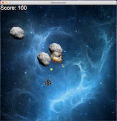
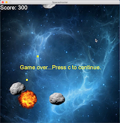

# CPPND: Final Project - Space shooter
## What is this?
A very simple space shooter game written in C++.

   
   

## Features
* You can control a spaceship with the left / right / up / down keys.
* Pressing the space key fires missles from a spaceship.
* If a missile collides with enemy, enemy explodes.
* If a enemy collides with spaceship, spaceship explodes and it's game over.
* Score gets updated depending on the number of enemies exploded.
* You can continue the game with C key after game over.

## Dependencies for Running Locally
* cmake >= 3.7
   * All OSes: [click here for installation instructions](https://cmake.org/install/)
* make >= 4.1 (Linux, Mac), 3.81 (Windows)
   * Linux: make is installed by default on most Linux distros
   * Mac: [install Xcode command line tools to get make](https://developer.apple.com/xcode/features/)
   * Windows: [Click here for installation instructions](http://gnuwin32.sourceforge.net/packages/make.htm)
* gcc/g++ >= 5.4
   * Linux: gcc / g++ is installed by default on most Linux distros
   * Mac: same deal as make - [install Xcode command line tools](https://developer.apple.com/xcode/features/)
   * Windows: recommend using [MinGW](http://www.mingw.org/)
* SDL2
   * Download both SDL source code and runtime binaries - [SDL Download](https://www.libsdl.org/download-2.0.php)
* SDL2 Image
   * Download both SDL source code and runtime binaries - [SDL_image Download](https://www.libsdl.org/projects/SDL_image/)
* SDL2 TTF
   * Download both SDL source code and runtime binaries - [SDL_ttf Download](https://www.libsdl.org/projects/SDL_ttf/)

## Basic Build Instructions
1. Clone this repo.
2. Make a build directory in the top level directory: `mkdir build && cd build`
3. Compile: `cmake .. && make`
4. Run it: `./FinalProject`

## Images
* Spaceship image is from [PNG MART](http://www.pngmart.com/image/26964)
* Asteroid image is from [PNG FLY](https://www.pngfly.com/png-ayw8n8/)
* Asteroid explosion image is from [pngimg.com](http://pngimg.com/download/15359)
* Spaceship explosion image is from [pngimg.com](http://pngimg.com/download/15382)
* Background image is from [PNG ALL](http://www.pngall.com/space-png/download/14520)